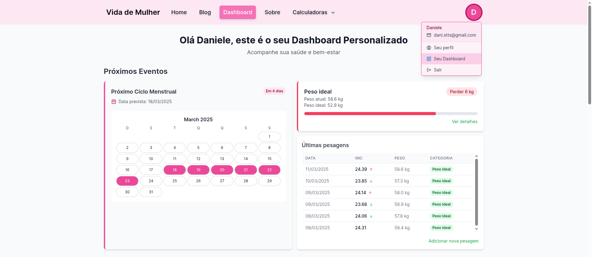
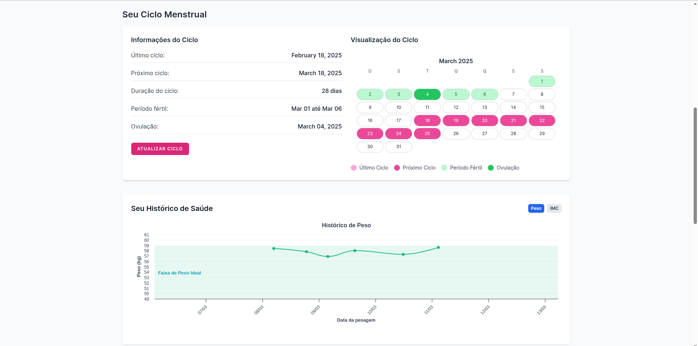
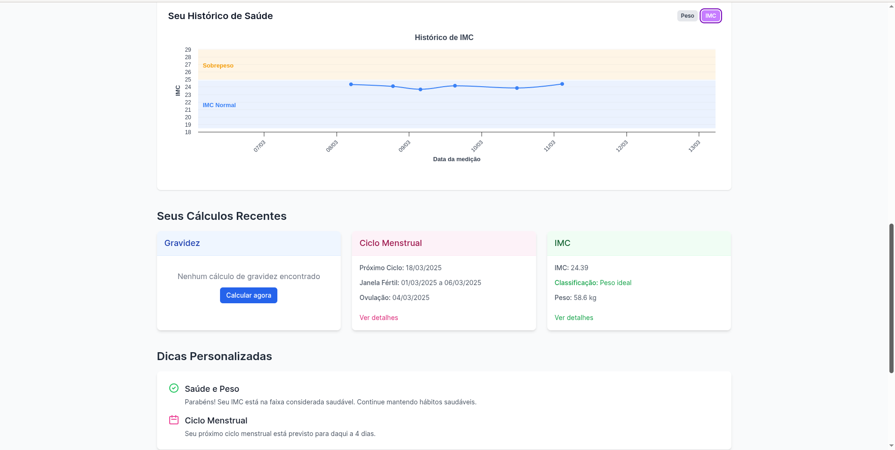
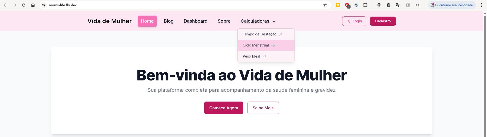
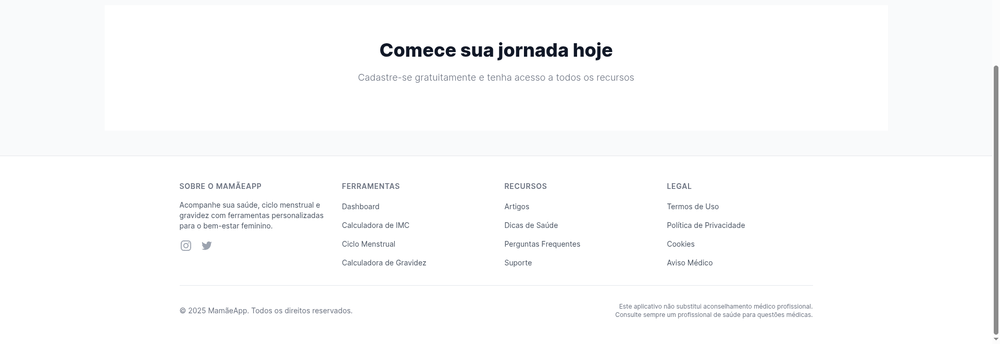
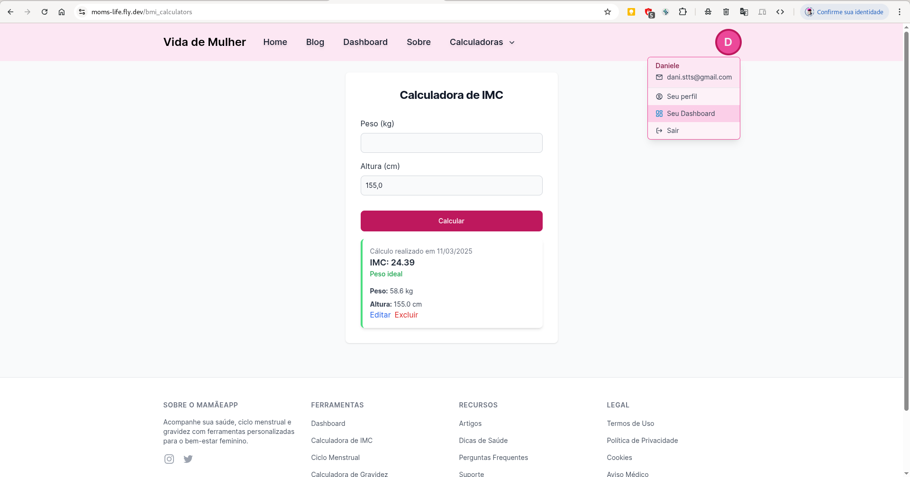
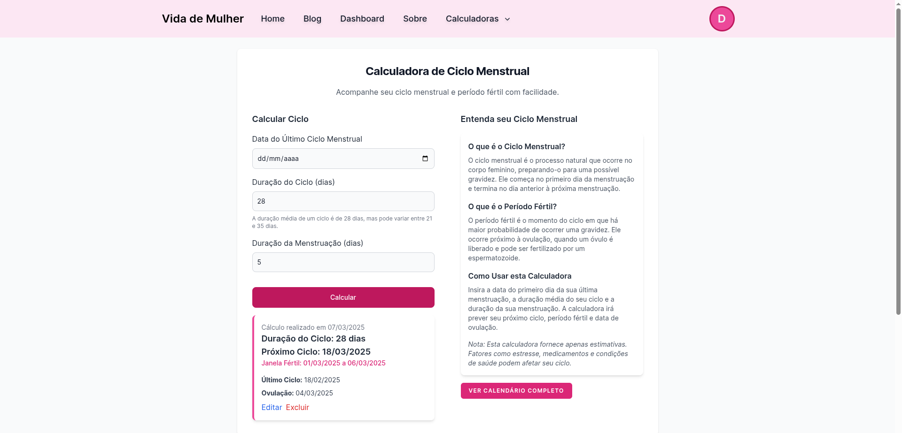

# README

Projeto focado em ajudar mulheres que estão grávidas, planejando engravidar, tentando evidar a graviês ou acompanhar
seus Índices de Massa Corporar (IMC) estando grávida ou não para manter o peso sob controle.

## Screenshots do Projeto

### Tela Inicial

### Dashboard de Usuário

### Navbar

### Footer

### Calculadoras

